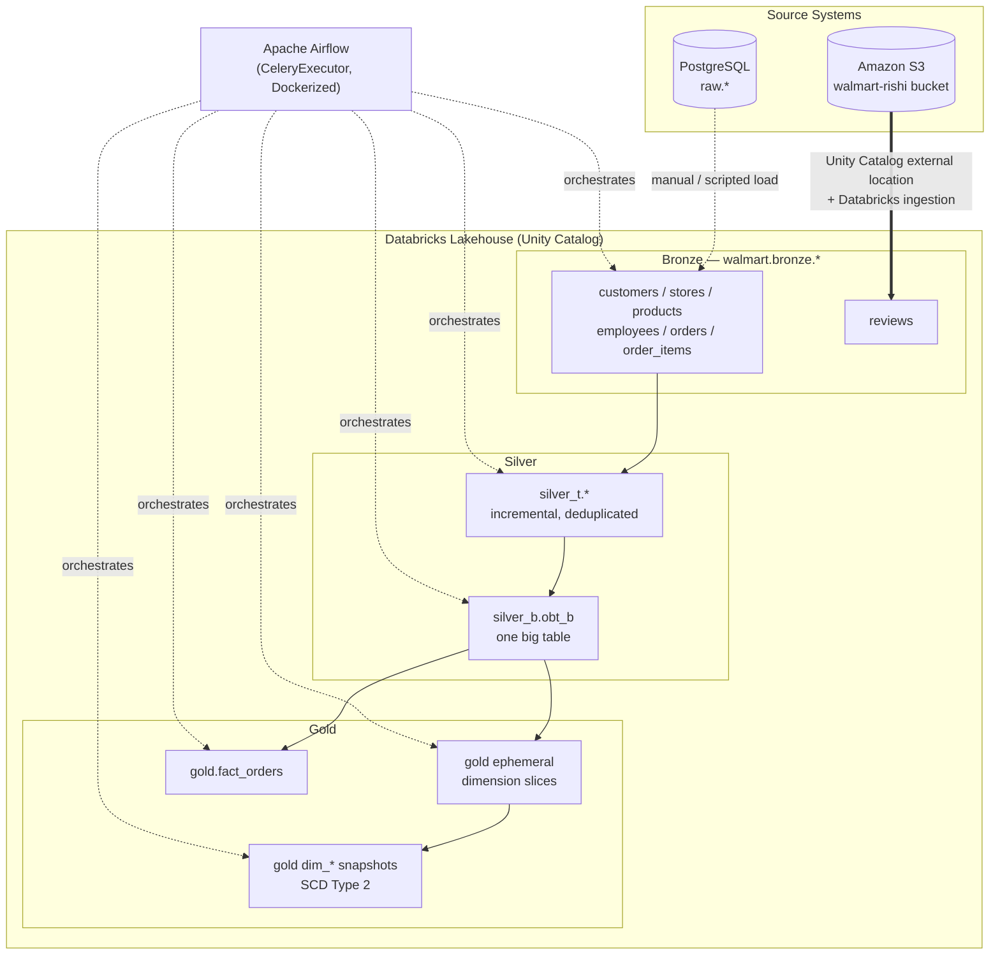

# Walmart Data Engineering Platform

An end-to-end retail data platform that takes raw transactional data (customers, stores,
products, employees, orders, order items) and an external supplementary feed (product
reviews) and turns them into analytics-ready, historically-tracked tables through a
medallion (bronze / silver / gold) architecture — orchestrated end to end with Apache
Airflow and transformed with dbt on Databricks.

## What this project does

1. **Ingests** operational retail data into a Postgres staging area and into a Databricks
   bronze layer backed by Amazon S3 (via a Unity Catalog external location), including a
   secondary ingestion path for supplementary files (e.g. product reviews) landed directly
   in S3.
2. **Transforms** bronze data through dbt into an incremental, deduplicated **silver**
   layer, then a flattened **One Big Table (OBT)**.
3. **Models** a conformed **gold** layer: deduplicated dimensions, full **SCD Type 2**
   history via dbt snapshots, and a fact table at order-item grain.
4. **Orchestrates** the whole pipeline — ingestion trigger, freshness checks, dbt runs,
   tests, snapshots — as a single Airflow DAG running on a containerized Celery-based
   Airflow deployment.

## Architecture at a glance



Full diagrams and design rationale live in [`docs/architecture/`](docs/architecture/overview.md).

## Repository layout

```text
Walmart/
├── walmart_dataset/          # Source CSVs, raw Postgres DDL, and the load script
│   ├── data/                 # customers, stores, products, employees, orders, order_items
│   ├── ddl/walmart_schema.sql
│   └── load_data.py
│
├── walmart-dbt/               # dbt project + Airflow orchestration
│   ├── walmart/               # dbt project root
│   │   ├── models/
│   │   │   ├── source/        # bronze source declarations
│   │   │   ├── silver_t/      # incremental silver models (one per entity)
│   │   │   ├── silver_b/      # the One Big Table join
│   │   │   └── gold/          # ephemeral dimensions + fact table
│   │   ├── snapshots/         # SCD Type 2 dimension history
│   │   └── tests/             # custom data tests
│   ├── dags/orchestrate.py    # the end-to-end Airflow DAG
│   ├── docker-compose.yaml    # Airflow (Celery, Redis, Postgres metadata DB)
│   └── Dockerfile             # Airflow image extended with dbt-core + dbt-databricks
│
├── src/walmart/                # project package
└── docs/                       # full documentation set (see below)
```

## Documentation

| Section                                                  | What's in it                                                                                         |
| -------------------------------------------------------- | ---------------------------------------------------------------------------------------------------- |
| [`docs/architecture/`](docs/architecture/overview.md)    | System overview, medallion layer design, data flow, infrastructure diagrams                          |
| [`docs/data-model/`](docs/data-model/data-dictionary.md) | Full column-level data dictionary and entity-relationship diagrams for every layer                   |
| [`docs/dbt/`](docs/dbt/project-guide.md)                 | dbt project guide, model lineage, testing strategy, and a dedicated doc per model                    |
| [`docs/airflow/`](docs/airflow/orchestration-guide.md)   | DAG design, task-by-task reference, Docker/Celery setup                                              |
| [`docs/setup/`](docs/setup/local-development.md)         | Getting a local environment running: Postgres, Databricks + Unity Catalog, S3, environment variables |
| [`docs/operations/`](docs/operations/runbook.md)         | Day-2 operations: runbook, troubleshooting guide, release process                                    |
| [`CHANGELOG.md`](CHANGELOG.md)                           | Full version history of the platform                                                                 |
| [`docs/CONTRIBUTING.md`](docs/CONTRIBUTING.md)           | Branching, commit, and release workflow                                                              |

## Quick start

```bash
# 1. Python environment (uv-managed workspace: root + walmart-dbt)
uv sync

# 2. Raw layer: load source CSVs into Postgres
psql "$POSTGRES_CONNECTION_STRING" -f walmart_dataset/ddl/walmart_schema.sql
cd walmart_dataset && uv run python load_data.py

# 3. dbt: build the silver + gold layers against Databricks
cd walmart-dbt/walmart
dbt run && dbt snapshot && dbt test

# 4. Airflow: bring up the full orchestration stack
cd walmart-dbt
docker compose up -d
# UI at http://localhost:8080
```

See [`docs/setup/local-development.md`](docs/setup/local-development.md) for the complete,
step-by-step version of the above, including how the Databricks Unity Catalog external
location and S3 bucket are wired up.

## Tech stack

- **Storage / warehouse:** PostgreSQL (raw staging), Databricks Lakehouse with Unity
  Catalog, Amazon S3 (external bronze storage)
- **Transformation:** dbt-core + dbt-databricks (incremental models, snapshots, tests)
- **Orchestration:** Apache Airflow 3.2.2 (CeleryExecutor, Redis broker, Postgres metadata
  DB), fully Dockerized
- **Language/tooling:** Python 3.13, managed with `uv` as a multi-project workspace
