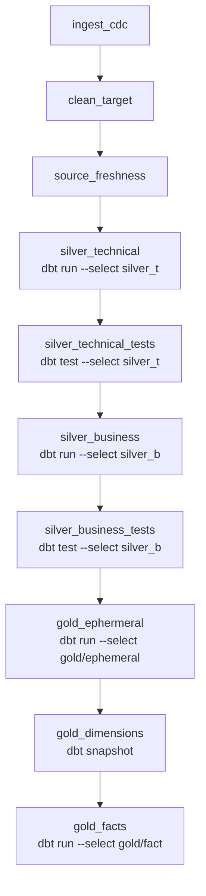

# Airflow Orchestration Guide

## Why Airflow, and why this DAG shape

The pipeline has a strict dependency order — bronze must refresh before silver can
run, `obt_b` must exist before any gold model can build, dimensions must be
deduplicated before they can be snapshotted — and every stage benefits from
independent retry, logging, and alerting. Airflow's DAG model maps directly onto
that: one task per pipeline stage, wired together with explicit `>>` dependencies,
each independently retriable without re-running stages that already succeeded.

## The DAG: `orchestrate`

Defined in `walmart-dbt/dags/orchestrate.py`, using Airflow's TaskFlow API
(`@dag`, `@task`, `@task.bash`) mixed with classic `BashOperator` instances.

## Task-by-task

1. **`ingest_cdc`** (`@task`, Python) — connects to Databricks via
   `databricks.sdk.WorkspaceClient`, triggers a job run with `ws.jobs.run_now(job_id=...)`,
   then polls `ws.jobs.get_run(...)` every 5 seconds until the run reaches a terminal
   `life_cycle_state` (`TERMINATED`, `SKIPPED`, or `INTERNAL_ERROR`). A non-`SUCCESS`
   terminal `result_state` raises an exception, failing this task (and the whole DAG
   run) rather than proceeding on top of a failed ingestion.
2. **`clean_target`** (`@task.bash`) — `rm -rf` on the dbt project's `target/` and
   `logs/` directories, so every DAG run parses fresh rather than reusing a
   potentially stale partial-parse cache.
3. **`source_freshness`** (`@task.bash`) — `cd`s into the dbt project and runs
   `dbt source freshness`, checking bronze staleness before any model touches it.
4. **`silver_technical`** / **`silver_technical_tests`** (`BashOperator`) — `dbt run`
   then `dbt test`, both `--select silver_t`.
5. **`silver_business`** / **`silver_business_tests`** (`BashOperator`) — same pattern,
   `--select silver_b`.
6. **`gold_ephermeral`** (`BashOperator`) — `dbt run --select gold/ephemeral`.
7. **`gold_dimensions`** (`BashOperator`) — `dbt snapshot`, capturing SCD Type 2
   history for all five dimensions in one command.
8. **`gold_facts`** (`BashOperator`) — `dbt run --select gold/fact`.

All `BashOperator` tasks run with `cwd='/opt/airflow/walmart'` — the container path
where the dbt project is volume-mounted (see
[`../architecture/infrastructure.md`](../architecture/infrastructure.md)).

## Configuration

- **Databricks credentials** (`DATABRICKS_HOST`, `DATABRICKS_TOKEN`,
  `DATABRICKS_JOB_ID`) are read via `os.environ` inside `ingest_cdc`, sourced from
  `walmart-dbt/.env` (gitignored) and passed into every Airflow container through
  Docker Compose's `env_file` directive — never hardcoded in the DAG file.
- The DAG is fully linear — every task depends on exactly the one before it — which
  is a deliberate simplification: nothing downstream of `silver_t` is safe to run
  before it completes, so there's no parallelism to exploit within a single run.

## Related

- [`dag-reference.md`](dag-reference.md) — operational reference for each task (retries, failure modes)
- [`docker-setup.md`](docker-setup.md) — the Airflow deployment this DAG runs on
- [`../architecture/data-flow.md`](../architecture/data-flow.md) — the same flow, framed around the data itself rather than the DAG
