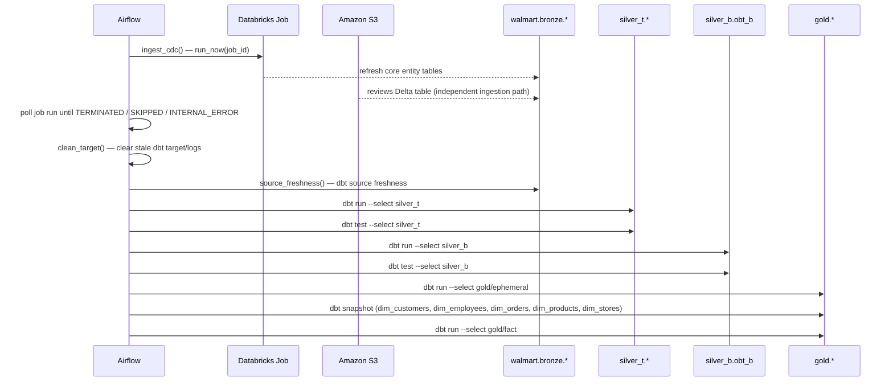

# Data Flow

This document walks the platform's data lifecycle from source to gold, in the order
the Airflow DAG actually executes it.

## End-to-end sequence

## Step-by-step

1. **`ingest_cdc`** triggers a Databricks job (via the Databricks SDK's `WorkspaceClient`)
   and polls its run status every 5 seconds until it reaches a terminal state. A
   non-success terminal state raises immediately, failing the DAG run rather than
   silently continuing on top of stale data.
2. **`clean_target`** removes the dbt project's `target/` and `logs/` directories before
   the run starts, so every DAG run compiles fresh rather than reusing a stale partial-parse
   cache from a previous run.
3. **`source_freshness`** runs `dbt source freshness` against the bronze layer — if bronze
   hasn't been refreshed recently enough, this is the step that surfaces it, before any
   downstream model wastes time transforming stale data.
4. **Silver technical layer** (`dbt run/test --select silver_t`) rebuilds each entity's
   incremental model and runs its data tests.
5. **Silver business layer** (`dbt run/test --select silver_b`) rebuilds the OBT from the
   now-current silver_t tables.
6. **Gold ephemeral dimensions** (`dbt run --select gold/ephemeral`) recompiles the
   deduplicated dimension slices — these don't persist anywhere themselves, they exist to
   feed the next step.
7. **Gold snapshots** (`dbt snapshot`) capture the current state of each dimension,
   appending new history rows only where something actually changed since the last
   snapshot.
8. **Gold fact table** (`dbt run --select gold/fact`) rebuilds `fact_orders` from the OBT.

## Incremental behavior

Two different incremental mechanisms are in play, and they matter for reasoning about
what any given DAG run actually changes:

- **`silver_t` models** are incremental in the dbt sense: each run only processes rows
  newer than what's already in the target table (per `updated_timestamp`). A change to a
  model's filtering logic does **not** retroactively apply to rows already materialized —
  that requires `dbt run --full-refresh` on the affected model(s).
- **Gold snapshots** are incremental in the SCD Type 2 sense: every run compares the
  current dimension state against the last snapshot and appends a new row only for
  entities whose tracked columns actually changed, closing out the previous version's
  `dbt_valid_to` at the same time.

## Related documents

- [`overview.md`](overview.md) — why the pipeline is shaped this way
- [`infrastructure.md`](infrastructure.md) — what's actually running to make this happen
- [`../airflow/dag-reference.md`](../airflow/dag-reference.md) — task-by-task Airflow reference
