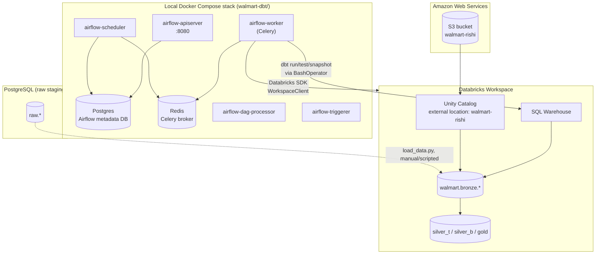

# Infrastructure

What actually runs, where, and how the pieces connect.

## Component diagram

## Local Docker Compose stack

Defined in `walmart-dbt/docker-compose.yaml`, built from `walmart-dbt/Dockerfile`
(`apache/airflow:3.2.2` base, extended with `dbt-core`, `dbt-databricks`, and
`databricks-sdk`). Services:

| Service | Role |
|---|---|
| `postgres` | Airflow's own metadata database (separate from the project's raw-data Postgres) |
| `redis` | Celery message broker |
| `airflow-apiserver` | Web UI + REST API, port 8080 |
| `airflow-scheduler` | Schedules DAG runs, evaluates task dependencies |
| `airflow-dag-processor` | Parses DAG files independently of the scheduler |
| `airflow-worker` | Executes tasks via Celery |
| `airflow-triggerer` | Handles deferred/async tasks |
| `airflow-init` | One-shot: runs DB migrations, creates the default user, fixes volume ownership |

All services share a common environment block (`x-airflow-common`) and mount the same
four standard Airflow directories plus the dbt project itself:

| Host path | Container path | Purpose |
|---|---|---|
| `dags/` | `/opt/airflow/dags` | DAG definitions |
| `logs/` | `/opt/airflow/logs` | Airflow task logs |
| `config/` | `/opt/airflow/config` | Custom `airflow.cfg` |
| `plugins/` | `/opt/airflow/plugins` | Custom plugins |
| `walmart/` | `/opt/airflow/walmart` | The dbt project itself, so `BashOperator` tasks can `cd` into it and run `dbt` directly |

## Databricks Lakehouse

- **Unity Catalog** governs the `walmart` catalog, with `bronze`, `silver_t`,
  `silver_b`, and `gold` (plus per-model overrides for the `ephemeral` sub-path)
  as schemas — configured directly in `dbt_project.yml` via per-folder `+schema`
  settings and a custom `generate_schema_name` macro that uses the declared schema
  name exactly as given, rather than prefixing it with the target's default schema.
- **An external location** (`walmart-rishi`, backed by S3 bucket `s3://walmart-rishi`)
  gives Databricks governed access to data sitting in S3, used for the `reviews`
  ingestion path. See [`../setup/s3-integration.md`](../setup/s3-integration.md) for
  exactly how this was provisioned and what it's used for.
- **A SQL Warehouse** is the compute endpoint dbt connects to (`type: databricks` in
  `profiles.yml`), addressed via `host` + `http_path` + a personal access token.

## PostgreSQL (raw staging)

A separate, plain PostgreSQL instance holds the `raw` schema — the very first landing
point for the six core CSV-derived entities, loaded via `walmart_dataset/load_data.py`
using `psycopg` 3's `COPY` streaming API. This is intentionally decoupled from
Databricks: it's the layer where the source CSVs are validated against a strict,
typed DDL (`walmart_dataset/ddl/walmart_schema.sql`) before anything reaches the
lakehouse.

## Related documents

- [`../setup/local-development.md`](../setup/local-development.md) — how to bring all of this up yourself
- [`../setup/databricks-unity-catalog-setup.md`](../setup/databricks-unity-catalog-setup.md)
- [`../setup/s3-integration.md`](../setup/s3-integration.md)
- [`../airflow/docker-setup.md`](../airflow/docker-setup.md)
