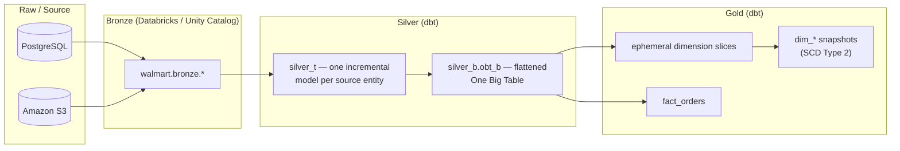

# Architecture Overview

## Purpose

This platform exists to turn Walmart's operational retail data — customers, stores,
products, employees, orders, order line items, plus a supplementary product-reviews
feed — into a single, trustworthy, historically-accurate set of analytics tables that
downstream reporting and analysis can rely on without re-deriving business logic.

The design follows a **medallion architecture** (bronze → silver → gold), a pattern
chosen specifically because it separates three concerns that otherwise get tangled
together in ad-hoc pipelines:

- **Bronze**: an unopinionated, as-close-to-source-as-possible copy of the data.
- **Silver**: cleaned, deduplicated, incrementally-maintained technical tables.
- **Gold**: business-conformed dimensions and facts, with full change history.

## The three-tier pipeline

## Why this shape, specifically

**Bronze is the trust boundary.** Nothing downstream ever queries a source system
directly — every transformation, test, and report depends only on bronze, which means
the moment a source schema changes, there is exactly one place to reconcile it.

**Silver has two distinct jobs, so it's two distinct layers.** `silver_t` (the
"technical" layer) does the unglamorous, per-entity work: incremental loading,
deduplication by primary key, and change tracking via `updated_timestamp`. `silver_b`
(the "business" layer) does the opposite kind of work: it denormalizes everything into
one wide table (`obt_b`) so that gold-layer logic never has to re-derive a join that's
already been solved once, correctly, in one place.

**Gold is deliberately three different shapes for three different reasons:**

- _Ephemeral dimension models_ exist purely to peel a clean, deduplicated dimension
  back out of the flattened OBT — they compile inline into whatever references them
  and never materialize as their own table, because their only job is reshaping data
  that's about to be snapshotted.
- _Snapshots_ exist because dimension attributes change over time (a customer moves
  city, a product's price changes) and the business needs to answer "what was true on
  a given date," not just "what's true right now." This is exactly the incremental
  problem that dbt snapshots solve.
- _The fact table_ exists at order-item grain — the finest grain in the entire
  dataset — because it's the only grain with no duplication to collapse; every other
  entity repeats across an order (a customer has many orders, an order has many
  items), which is precisely why those entities get their own dimension instead.

## Orchestration

A single Airflow DAG (see [`docs/airflow/orchestration-guide.md`](../airflow/orchestration-guide.md))
drives the whole pipeline in dependency order: trigger ingestion → clean stale
artifacts → check source freshness → build silver → test silver → build the OBT → test
the OBT → build gold dimensions → snapshot gold dimensions → build the gold fact table.
Every step is a discrete, independently-retriable Airflow task.

## Where to go next

- [`medallion-layers.md`](medallion-layers.md) — deep dive on bronze/silver/gold, layer by layer
- [`data-flow.md`](data-flow.md) — the full request/data lifecycle, sequence-diagram style
- [`infrastructure.md`](infrastructure.md) — what actually runs where (Docker, Databricks, AWS)
- [`../data-model/data-dictionary.md`](../data-model/data-dictionary.md) — every table and column
