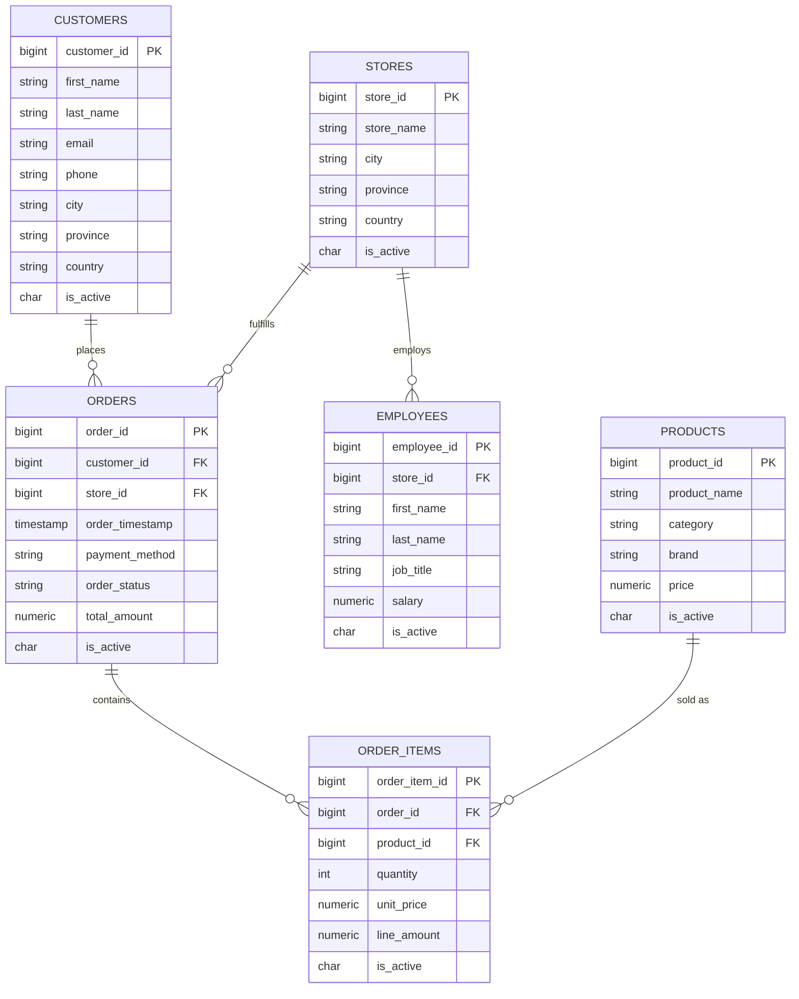
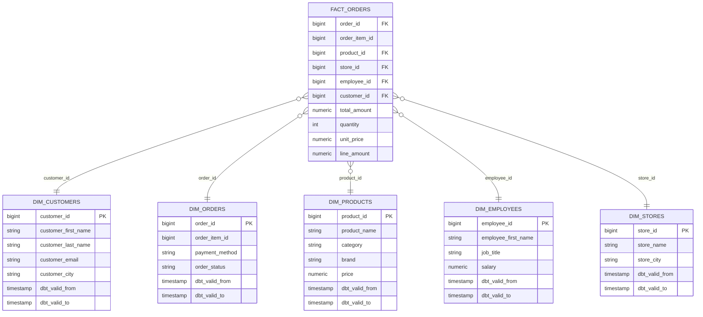
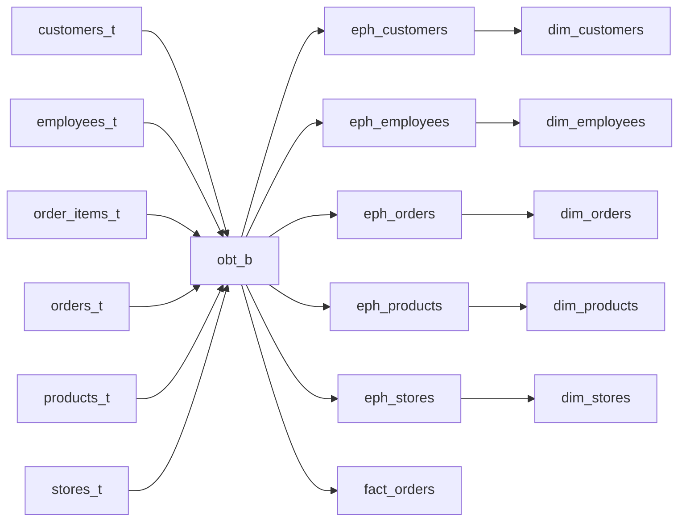

# Entity-Relationship Diagrams

## Raw / Bronze — operational schema

This is the shape of the data as it exists at source, before any dbt transformation.

## Gold — star schema

The conformed dimensional model that analytics actually queries: `fact_orders` at the
center, joined out to five SCD Type 2 dimension snapshots.

Note the fact table joins to dimensions by natural key (`customer_id`, `order_id`, etc.),
not by a surrogate snapshot key — point-in-time-correct joins are achieved by additionally
filtering the dimension snapshot on `dbt_valid_from <= <as-of-date> < dbt_valid_to`, not
by carrying `dbt_scd_id` on the fact row itself.

## Silver → Gold lineage (model level)

