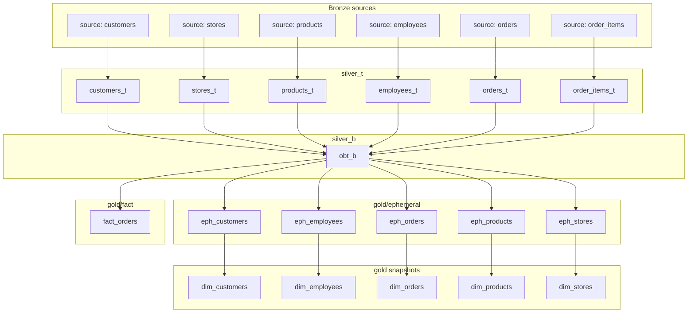

# Model Lineage

## Full dependency graph

## Reading this graph

- **Fan-in at `obt_b`**: every silver_t table feeds the OBT — this is the *only* place
  in the whole project where a join happens. Every model downstream of `obt_b` reads
  from it exclusively; none of them re-join silver_t tables directly.
- **Fan-out from `obt_b`**: gold ephemeral models and `fact_orders` are siblings, not a
  chain — none of the ephemeral dimensions depend on the fact table or on each other.
  This means they can (and, in the Airflow DAG, effectively do) build independently of
  one another once `obt_b` exists.
- **`eph_* → dim_*` is 1:1**: each ephemeral model has exactly one corresponding
  snapshot. There's no shared ephemeral model feeding multiple snapshots.

## Selecting subsets with dbt's node selector

The layering maps directly onto dbt's `--select` syntax, which is what the Airflow DAG
uses to run each stage independently:

| Command | Builds |
|---|---|
| `dbt run --select silver_t` | all six `*_t` models |
| `dbt run --select silver_b` | `obt_b` only |
| `dbt run --select gold/ephemeral` | all five `eph_*` models |
| `dbt run --select gold/fact` | `fact_orders` only |
| `dbt run --select +fact_orders` | `fact_orders` and everything it depends on |
| `dbt run --select obt_b+` | `obt_b` and everything downstream of it |

## Related

- [`project-guide.md`](project-guide.md)
- [`../data-model/entity-relationship-diagram.md`](../data-model/entity-relationship-diagram.md) — the same graph, entity-relationship style
