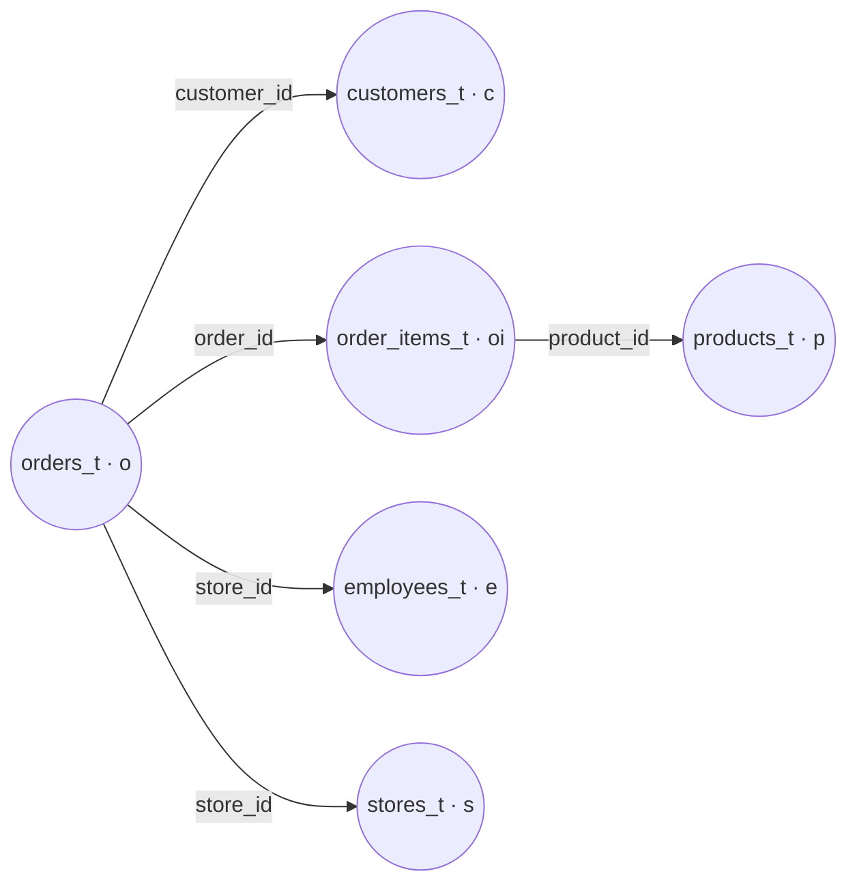

# Model: `obt_b`

**Layer:** silver_b · **Materialization:** table · **Schema:** `silver_b` · **Grain:** one row per `order_item_id`

## Purpose

The One Big Table: flattens all six `silver_t` entities into a single denormalized
table, anchored on `orders`. This is the only place in the entire project where a
join is written — every gold-layer model reads from `obt_b` instead of re-deriving
these relationships.

## Structure

Built from a Jinja config list rather than hand-written SQL, so each joined entity is
declared once as data, not duplicated as query logic:

```jinja
{% set configs = [
    {"table": "walmart.silver_t.orders_t", "alias": "o",
     "columns": "o.order_id, o.store_id, o.order_timestamp, o.payment_method,
                 o.order_status, o.total_amount, o.created_timestamp AS order_created_timestamp,
                 o.updated_timestamp AS order_updated_timestamp, o.is_active AS order_is_active,
                 o.processed_at AS order_processed_at, current_timestamp() AS obt_b_processed_at"},

    {"table": "walmart.silver_t.customers_t", "alias": "c",
     "join_condition": "o.customer_id = c.customer_id",
     "columns": "c.customer_id, c.first_name AS customer_first_name, ..."},

    {"table": "walmart.silver_t.order_items_t", "alias": "oi",
     "join_condition": "o.order_id = oi.order_id",
     "columns": "oi.order_item_id, oi.quantity, oi.unit_price, oi.line_amount, ..."},

    {"table": "walmart.silver_t.products_t", "alias": "p",
     "join_condition": "oi.product_id = p.product_id",
     "columns": "p.product_id, p.product_name, p.category, p.brand, p.price, ..."},

    {"table": "walmart.silver_t.employees_t", "alias": "e",
     "join_condition": "o.store_id = e.store_id",
     "columns": "e.employee_id, e.first_name AS employee_first_name, ..."},

    {"table": "walmart.silver_t.stores_t", "alias": "s",
     "join_condition": "o.store_id = s.store_id",
     "columns": "s.store_name, s.city AS store_city, ..."},
] %}

SELECT
    
        {{ config['columns'] }},
    
FROM
    
        
            {{ config['table'] }} AS {{ config['alias'] }}
        
LEFT JOIN {{ config['table'] }} AS {{ config['alias'] }} ON {{ config['join_condition'] }}
        
    
```

## Join graph



All joins are `LEFT JOIN` off `orders_t` — an order with, say, no matched employee
still produces a row, with employee columns null, rather than dropping out of the OBT
entirely. This is exactly what [`test_obt`](../../testing-strategy.md) checks for.

## Columns

Every source entity's columns, prefixed to avoid collisions (`customer_*`,
`employee_*`, `product_*`, `store_*`; order and order-item columns are largely
unprefixed since they define the grain). Full listing in
[`../../../data-model/data-dictionary.md`](../../../data-model/data-dictionary.md#silver_bobt_b--the-one-big-table).

## Downstream consumers

Every gold-layer model reads from `obt_b`: `eph_customers`, `eph_employees`,
`eph_orders`, `eph_products`, `eph_stores`, and `fact_orders`.

## Related

- [`../../lineage.md`](../../lineage.md)
- [`../../../data-model/silver-layer.md`](../../../data-model/silver-layer.md)
- [`../../testing-strategy.md`](../../testing-strategy.md)
